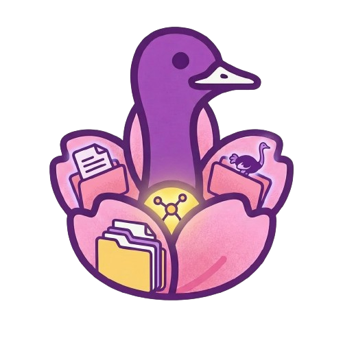

<p align="center">
  
</p>

<h1 align="center">Bloom</h1>

<p align="center">
  <strong>A self-hosted, decentralized media server and Nostr relay in your pocket.</strong>
</p>

<p align="center">
  
  
  
  
  
</p>

---

**Bloom** is a cross-platform application that bundles a full **Blossom protocol media server** and **Nostr relay** into a single, user-friendly package.
Run your own sovereign file storage and relay from your desktop or phone — no server administration required.

## Your Media, Your Rules

Bloom is built on the belief that your data belongs to you. By implementing the full Blossom protocol specification,
it gives you a personal media server that integrates natively with the Nostr ecosystem.

### Core Principles

- **Sovereign Storage**: Your files live on your machine, served on your terms. No third-party hosting.
- **Full Protocol Compliance**: Implements BUD-00 through BUD-10 for complete Blossom compatibility.
- **Integrated Relay**: A built-in Nostr relay runs alongside your media server.
- **Cross-Platform**: Desktop (macOS, Windows, Linux) and Mobile (Android, iOS) from a single codebase.

## Features

Everything you need to run a personal media node on the Nostr network.

- **Blob Storage & Retrieval**: Upload, download, and manage files with SHA-256 content addressing (BUD-01/02).
- **Blob Mirroring**: Pull and verify blobs from remote Blossom servers (BUD-04).
- **NIP-94 Metadata**: Rich file metadata tags for Nostr event integration (BUD-08).
- **Blossom URIs**: Native `blossom://` URI scheme parsing and resolution (BUD-10).
- **Background Sync**: System tray presence on desktop, foreground services on Android.

## Cross-Platform Experience

Bloom delivers a unified experience across Desktop (macOS, Windows, Linux) and Mobile.

- **Desktop**: Native performance with system tray integration and background sync.
- **Mobile**: Android foreground service with persistent notifications; iOS background tasks.

## Getting Started

### Installation & Development

```bash
# 1. Clone & Install
npm install

# 2. Start Desktop Dev Environment
npm run tauri dev

# 3. Start Android Dev Environment
npm run android dev
```

### Production Builds

```bash
# Build Desktop application
npm run tauri build

# Build signed release (all platforms)
./scripts/build.sh
```

> [!WARNING]
> **iOS Artifacts:** iOS builds are currently **not signed** as a developer account is not yet available. Use and run at your own risk.
>
> **macOS Desktop:** If the desktop artifact fails to open because it is "damaged" or from an unidentified developer, run:
> `sudo xattr -rd com.apple.quarantine /Applications/Bloom.app`

### Quality Assurance

Maintain code standards and run all tests:

```bash
npm run check
```

---

Open source. Built on Nostr.
